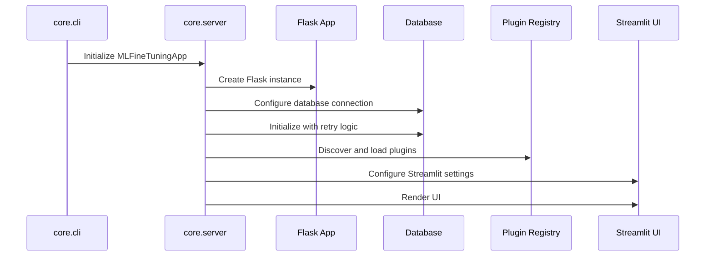
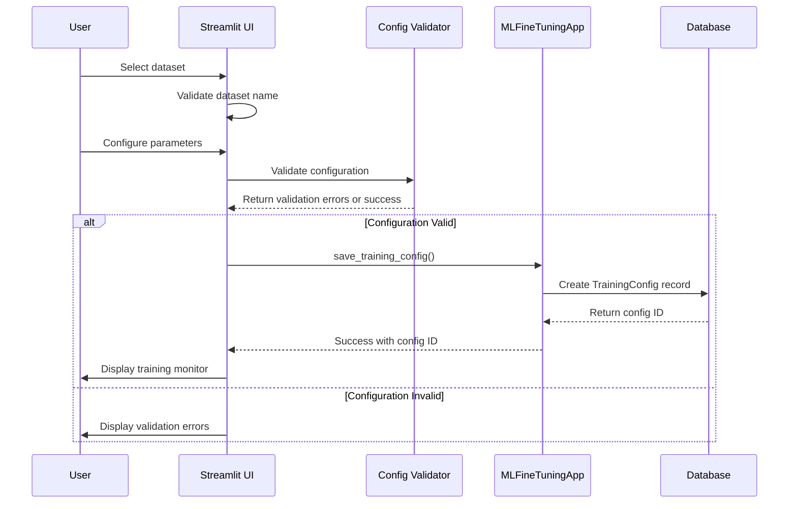
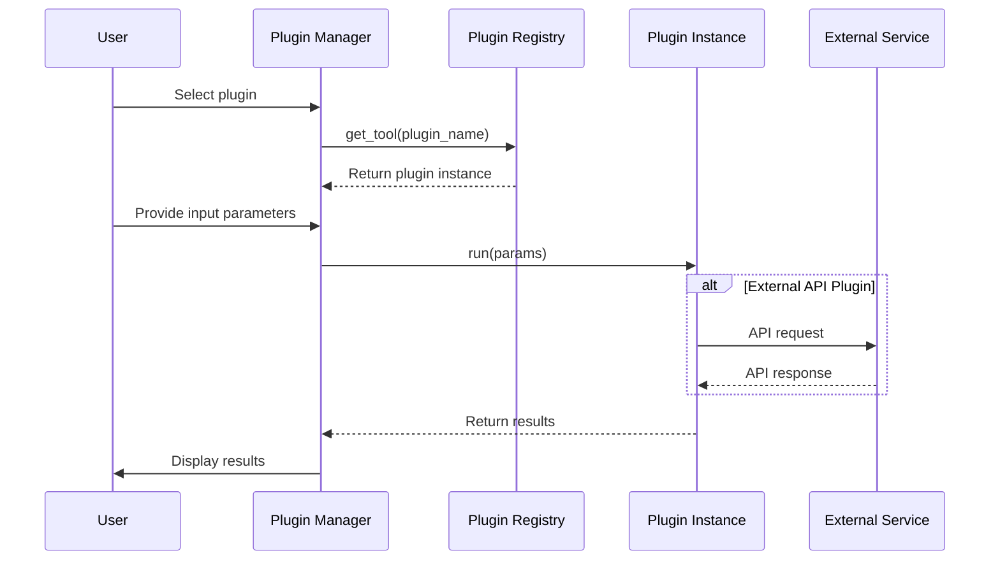

# CodeTune Studio Architecture

This document provides a comprehensive overview of the CodeTune Studio architecture, component relationships, and design decisions.

## Table of Contents

- [Overview](#overview)
- [System Architecture](#system-architecture)
- [Core Components](#core-components)
- [Data Flow](#data-flow)
- [Technology Stack](#technology-stack)
- [Design Patterns](#design-patterns)
- [Deployment Architecture](#deployment-architecture)

## Overview

CodeTune Studio is a production-ready ML model fine-tuning platform built with a hybrid Streamlit/Flask architecture. It combines an interactive web UI with a robust backend for managing training configurations, experiments, and plugin-based code analysis.

### Key Design Goals

1. **Modularity**: Plugin-based architecture for extensibility
2. **Scalability**: Support for distributed training and large datasets
3. **Reliability**: Robust error handling and database failover
4. **Developer Experience**: Clear separation of concerns and intuitive APIs
5. **Production-Ready**: Comprehensive logging, monitoring, and deployment support

## System Architecture

```
┌─────────────────────────────────────────────────────────────┐
│                     User Interface Layer                     │
│                   (Streamlit Web UI)                        │
└────────────┬────────────────────────────────────────────────┘
             │
             │ HTTP/WebSocket
             │
┌────────────▼────────────────────────────────────────────────┐
│                   Application Layer                          │
│  ┌──────────────┐  ┌──────────────┐  ┌──────────────┐     │
│  │  core.cli    │  │ core.server  │  │ core.logging │     │
│  │  (CLI Entry) │  │ (App Logic)  │  │  (Logging)   │     │
│  └──────────────┘  └──────────────┘  └──────────────┘     │
└────────────┬────────────────────────────────────────────────┘
             │
    ┌────────┴────────┐
    │                  │
┌───▼──────────┐  ┌───▼──────────┐
│  Components  │  │   Plugins     │
│  (UI Widgets)│  │  (Analysis)   │
└───┬──────────┘  └───┬──────────┘
    │                  │
┌───▼──────────────────▼──────────────────────────────────────┐
│                    Service Layer                             │
│  ┌──────────────┐  ┌──────────────┐  ┌──────────────┐     │
│  │   Database   │  │  Validation  │  │  Training    │     │
│  │   (SQLAlch)  │  │  (Config)    │  │  (PEFT)      │     │
│  └──────────────┘  └──────────────┘  └──────────────┘     │
└────────────┬────────────────────────────────────────────────┘
             │
┌────────────▼────────────────────────────────────────────────┐
│                  Persistence Layer                           │
│  ┌──────────────┐  ┌──────────────┐  ┌──────────────┐     │
│  │  PostgreSQL  │  │    SQLite    │  │  HuggingFace │     │
│  │  (Primary)   │  │  (Fallback)  │  │   (Datasets) │     │
│  └──────────────┘  └──────────────┘  └──────────────┘     │
└─────────────────────────────────────────────────────────────┘
```

## Core Components

All Python source code is organized under the `src/` directory for better namespace management and adherence to Python packaging best practices.

### 1. Core Module (`src/core/`)

The `core` module contains the essential application logic and entry points.

#### `src/core/__init__.py`
- Defines package version (`__version__`)
- Exports core functionality

#### `src/core.cli` - Command-Line Interface
```python
# Entry point: codetune-studio
- Argument parsing (host, port, database, log level)
- Environment variable management
- Streamlit process orchestration
```

**Responsibilities:**
- Parse command-line arguments
- Configure environment variables
- Launch Streamlit application
- Handle graceful shutdown

#### `core.server` - Application Server
```python
class MLFineTuningApp:
    - Flask backend initialization
    - Database configuration and retry logic
    - Streamlit UI setup
    - Plugin discovery and loading
    - Training configuration management
```

**Responsibilities:**
- Application lifecycle management
- Database connection pooling
- Plugin system integration
- UI component coordination
- Error boundary management

#### `core.logging` - Centralized Logging
```python
- Structured logging with color support
- Rotating file handlers
- Multiple log levels (DEBUG, INFO, WARNING, ERROR, CRITICAL)
- Integration with system monitoring
```

**Responsibilities:**
- Configure application-wide logging
- Format log messages consistently
- Route logs to console and file
- Support production monitoring

### 2. Components Module (`src/components/`)

Reusable Streamlit UI components for different application features.

```
src/components/
├── dataset_selector.py      # Dataset browsing and selection
├── parameter_config.py      # Training parameter configuration
├── training_monitor.py      # Real-time training monitoring
├── experiment_compare.py    # Experiment comparison and visualization
├── plugin_manager.py        # Plugin management UI
├── documentation_viewer.py  # Built-in documentation viewer
└── tokenizer_builder.py     # Tokenizer configuration
```

**Component Pattern:**
```python
def component_name(param1, param2=default):
    """
    Streamlit component for [feature].
    
    Args:
        param1: Description
        param2: Description (default: value)
    
    Returns:
        Component output or None
    """
    # Streamlit widget rendering
    # User interaction handling
    # State management
    return result
```

### 3. Utils Module (`src/utils/`)

Utility functions and backend services.

```
src/utils/
├── database.py              # SQLAlchemy models and database operations
├── config_validator.py      # Training configuration validation
├── plugins/                 # Plugin system implementation
│   ├── base.py             # BaseTool interface
│   └── registry.py         # Plugin discovery and management
├── peft_trainer.py         # Parameter-efficient fine-tuning
├── model_inference.py      # Model inference utilities
├── visualization.py        # Plotting and visualization helpers
└── model_versioning.py     # Model version management
```

### 4. Plugins Module (`src/plugins/`)

Extensible code analysis plugins.

```
src/plugins/
├── __init__.py
├── code_analyzer.py         # Base code analysis
├── openai_code_analyzer.py  # OpenAI-powered analysis
└── anthropic_code_suggester.py  # Anthropic Claude integration
```

**Plugin Architecture:**
- All plugins inherit from `BaseTool`
- Automatic discovery via plugin registry
- Lazy loading for performance
- Sandboxed execution environment

## Data Flow

### 1. Application Startup



### 2. Training Configuration Flow



### 3. Plugin Execution Flow



## Technology Stack

### Backend
- **Flask 3.0.0**: Web framework for API endpoints
- **SQLAlchemy 2.0.22**: ORM for database operations
- **PostgreSQL**: Primary production database
- **SQLite**: Development and fallback database

### Frontend
- **Streamlit 1.37.0+**: Interactive web UI framework
- **Plotly 6.4.0**: Data visualization

### Machine Learning
- **PyTorch 2.2.0+**: Deep learning framework
- **Transformers 4.53.0**: Pre-trained models and training utilities
- **PEFT**: Parameter-efficient fine-tuning
- **Accelerate 1.10.1**: Distributed training support
- **Datasets 4.3.0**: Dataset loading and processing

### Plugin Integrations
- **OpenAI API**: GPT-powered code analysis
- **Anthropic Claude**: Alternative AI code suggestions
- **Hugging Face Hub**: Model hosting and sharing

### Development Tools
- **Ruff**: Fast Python linter
- **Black**: Code formatter
- **Flake8**: Style checker
- **mypy**: Static type checker
- **pytest**: Testing framework

## Design Patterns

### 1. Factory Pattern - Plugin System

The plugin registry acts as a factory for creating plugin instances:

```python
class PluginRegistry:
    def get_tool(self, name: str) -> BaseTool:
        """Factory method for plugin instantiation"""
        if name in self._tools:
            return self._tools[name]()
        raise ValueError(f"Plugin not found: {name}")
```

### 2. Singleton Pattern - Database Session

Database connections use connection pooling with thread-safe access:

```python
class MLFineTuningApp:
    @contextmanager
    def session_scope(self):
        """Provides transactional scope with automatic commit/rollback"""
        session = db.session()
        try:
            yield session
            session.commit()
        except Exception:
            session.rollback()
            raise
        finally:
            session.close()
```

### 3. Strategy Pattern - Training Configurations

Different training strategies can be applied based on configuration:

```python
def select_training_strategy(config: Dict[str, Any]) -> TrainingStrategy:
    """Select appropriate training strategy based on config"""
    if config.get("use_peft"):
        return PEFTTrainingStrategy()
    elif config.get("distributed"):
        return DistributedTrainingStrategy()
    else:
        return StandardTrainingStrategy()
```

### 4. Observer Pattern - Training Monitoring

Training progress updates are broadcast to monitoring components:

```python
class TrainingMonitor:
    def __init__(self):
        self.observers = []
    
    def notify(self, metrics: Dict[str, float]):
        """Notify all observers of training progress"""
        for observer in self.observers:
            observer.update(metrics)
```

### 5. Repository Pattern - Data Access

Database operations are abstracted through repository interfaces:

```python
class TrainingConfigRepository:
    @staticmethod
    def find_by_id(config_id: int) -> Optional[TrainingConfig]:
        return TrainingConfig.query.filter_by(id=config_id).first()
    
    @staticmethod
    def find_by_dataset(dataset_name: str) -> List[TrainingConfig]:
        return TrainingConfig.query.filter_by(dataset_name=dataset_name).all()
```

## Deployment Architecture

### Local Development

```bash
# Using CLI
codetune-studio --host localhost --port 7860

# Using Python directly
python app.py
```

### Docker Deployment

```dockerfile
# Optimized multi-stage build
FROM python:3.10-slim
WORKDIR /app
COPY requirements.txt .
RUN pip install -r requirements.txt && pip install -e .
COPY . .
CMD ["codetune-studio", "--host", "0.0.0.0", "--port", "7860"]
```

### Production Considerations

1. **Load Balancing**: Deploy multiple instances behind a load balancer
2. **Database**: Use PostgreSQL with connection pooling
3. **Caching**: Redis for session storage and caching
4. **Monitoring**: Integrate with Prometheus/Grafana
5. **Logging**: Centralized logging with ELK stack
6. **Secrets**: Use environment variables or secret management services

### Environment Variables

Production deployments should configure:

```bash
# Application
HOST=0.0.0.0
PORT=7860
SERVER_HEADLESS=true

# Database
DATABASE_URL=postgresql://user:pass@db:5432/codetune

# Logging
LOG_LEVEL=INFO
LOG_FILE=/var/log/codetune/app.log

# API Keys (use secrets management)
OPENAI_API_KEY=sk-...
ANTHROPIC_API_KEY=sk-ant-...
HF_TOKEN=hf_...
```

## Security Considerations

### 1. Input Validation
- All user inputs are validated before processing
- SQL injection prevention through parameterized queries
- XSS protection in Streamlit components

### 2. Authentication & Authorization
- API key management for external services
- Configurable CORS policies
- Session management with secure cookies

### 3. Data Protection
- Database connection encryption
- Secure credential storage
- Audit logging for sensitive operations

### 4. Dependency Management
- Regular security audits
- Automated dependency updates
- Vulnerability scanning in CI/CD

## Performance Optimization

### 1. Database
- Connection pooling (10 connections, 20 overflow)
- Query optimization with indexes
- Automatic connection recycling (30 minutes)

### 2. Caching
- LRU cache for CSS loading
- Plugin instance caching
- Dataset metadata caching

### 3. Async Operations
- Background training tasks
- Async plugin execution
- Non-blocking UI updates

## Testing Strategy

### Unit Tests
- Component-level testing
- Plugin interface testing
- Utility function testing

### Integration Tests
- Database operations
- Plugin system integration
- API endpoint testing

### End-to-End Tests
- Complete training workflows
- UI interaction testing
- Multi-plugin scenarios

## Future Architecture Plans

### Planned Improvements

1. **Microservices**: Split into separate services for UI, training, and analysis
2. **Message Queue**: Add Celery/RabbitMQ for async task processing
3. **API Gateway**: REST API for programmatic access
4. **Multi-tenancy**: Support for multiple users/organizations
5. **Real-time Collaboration**: WebSocket-based collaborative features

### Scalability Roadmap

- Kubernetes deployment support
- Auto-scaling based on load
- Distributed model training
- CDN integration for assets
- Database sharding for large datasets

## Contributing

When modifying the architecture:

1. Update this document
2. Create architecture decision records (ADRs)
3. Update deployment documentation
4. Ensure backward compatibility
5. Add migration guides

## Resources

- [Flask Documentation](https://flask.palletsprojects.com/)
- [Streamlit Documentation](https://docs.streamlit.io/)
- [SQLAlchemy Documentation](https://docs.sqlalchemy.org/)
- [Transformers Documentation](https://huggingface.co/docs/transformers/)
- [Plugin Development Guide](./PLUGIN_GUIDE.md)

---

For questions or architectural discussions, please open an issue on [GitHub](https://github.com/canstralian/CodeTuneStudio/issues).
